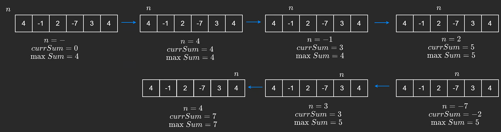

Kadane's algorithm is a greedy/dynamic programming algorithm that can be used on an array. It is used to calculate the maximum sum subarray ending at a particular position and typically runs in O(n) time.

The brute force way to approach this would be to go through every single subarray and calculate the sum, while keeping track of the maximum sum. For every iteration of our outer for loop, our inner loop does linear work. This makes the complexity O(n<sup>2</sup>).

```java
public static int bruteForce(int[] nums) {
    int maxSum = nums[0];

    for (int i = 0; i < nums.length; i++) { 
        int curSum = 0;
        for (int j = i; j < nums.length; j++) {
            curSum += nums[j];
            maxSum = Math.max(maxSum, curSum);
        }    
    }       
    return maxSum;
}
```

### Kadane's Algo

Since we are looking for the largest sum, it is a good idea to avoid negative numbers because we know that contradicts what the question is asking for. Negative numbers will only make our sum smaller.

But sometimes we may need to include a negative number to get the surrounding positive numbers.

For example, the array [6, -2, 7] has a maximum sum of 11. If we exclude the -2, we can't include both 6 and 7.
But that's not always the case. If we have [1, -3, 7], the maximum sum is 7. Including the -3 isn't worth it just to get the 1.
The pattern is that if we ever have a negative subarray sum, we should discard it and start a new subarray. This is because we know that the sum will only get smaller if we include it.

Kadane's algorithm runs one loop.
1. We keep track of the ```curSum``` by adding the current element to it.
2. Before we add the current element, we check if the ```curSum``` is negative. If it is, we reset it to zero.
3. We initialize the ```maxSum``` to the first element in the array. This is technically a subarray of size 1. (We could have initialized it to any other element in the array.)
4. We update the ```maxSum``` by taking the maximum of the current sum and the maximum sum so far.

It's possible that every element in the array is negative. In that case, the maximum sum would be the largest negative number.



```java
public static int kadanes(int[] nums) {
    int maxSum = nums[0];
    int curSum = 0;

    for (int n : nums) {
        curSum = Math.max(curSum, 0);
        curSum += n;
        maxSum = Math.max(maxSum, curSum);
    }
    return maxSum;
}
```


### Finding window

Sometimes, a problem may ask to return the actual subarray containing the largest sum, instead of just the sum itself. Previously, we didn't have two explicit pointers that kept track of the subarray in the previous implementation but we can actually do this by keeping track of a "window". A window in this case denotes a contiguous subarray that does not break our constraint of the sum staying positive.

To do this, we can have a left pointer, L = 0, and a right pointer, R. The left and right pointers define the boundaries of our window (inclusive).

Since we want the subarray with the maximum sum, we can also have two other pointers, maxL and maxR, which keep track of the subarray that contains the maximum sum so far. This way, we don't lose them when we move L and R.

Similar to before, if our current sum becomes negative, we can move our left pointer all the way to our right pointer. This means that our constraint was broken and we remove all elements from the left and start a new window.

```java
public static int[] slidingWindow(int[] nums) {
    int maxSum = nums[0];
    int curSum = 0;
    int maxL = 0, maxR = 0;
    int L = 0;

    for (int R = 0; R < nums.length; R++) {
        if (curSum < 0) {
            curSum = 0;
            L = R;
        }
        curSum += nums[R];
        if (curSum > maxSum) {
            maxSum = curSum;
            maxL = L; 
            maxR = R;     
        }    
    }    
    return new int[] {maxL, maxR};
}
```

### Time & Space Complexity
#### Time
Since we only make one pass through the array, our time complexity is O(n).

#### Space
With Kadane's algorithm, we only need a few variables to keep track of the maximum sum and the current sum. This makes our space complexity O(1).