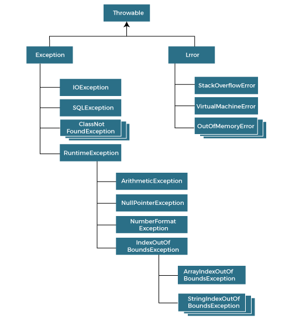

Exception is abnormal condition.

The java.lang.Throwable class is the root class of Java Exception hierarchy inherited by two subclasses: Exception and Error.


## Types of Java Exceptions

- **Checked Exception**      
    The classes that directly inherit the Throwable class except RuntimeException and Error are known as checked exceptions. For example, IOException, SQLException, etc. Checked exceptions are checked at compile-time.

- **Unchecked Exception**  
    The classes that inherit the RuntimeException are known as unchecked exceptions. For example, ArithmeticException, NullPointerException, ArrayIndexOutOfBoundsException, etc. Unchecked exceptions are not checked at compile-time, but they are checked at runtime.

- **Error**  
    Error is irrecoverable. Some example of errors are OutOfMemoryError, VirtualMachineError, AssertionError etc.

## Points

- At a time only one exception occurs and at a time only one catch block is executed.  
- All catch blocks must be ordered from most specific to most general, i.e. catch for ArithmeticException must come before catch for Exception.
- Finally is called even if no exception occurs
- The Java ```throw``` keyword is used to throw an exception explicitly.
- If we throw unchecked exception from a method, it is must to handle the exception or declare in throws clause.
- If the superclass method does not declare an exception, subclass overridden method cannot declare the checked exception but it can declare unchecked exception. [⤴︎](https://www.javatpoint.com/exception-handling-with-method-overriding)
- If the superclass method declares an exception, subclass overridden method can declare same, subclass exception or no exception but cannot declare parent exception.
