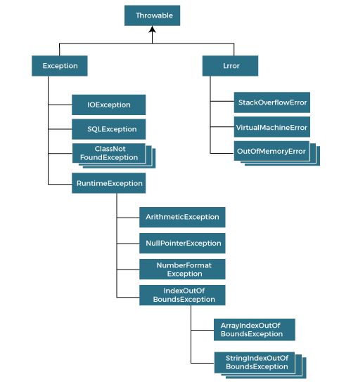

# Exception Handling

Exception is an abnormal condition that disrupts normal program flow.

The `java.lang.Throwable` class is the root class of Java Exception hierarchy inherited by two subclasses: Exception and Error.


## Types of Java Exceptions

- **Checked Exception**
    Classes that directly inherit `Throwable` except `RuntimeException` and `Error`. Examples: `IOException`, `SQLException`. Checked at **compile-time** — must be handled or declared in `throws`.

- **Unchecked Exception**
    Classes that inherit `RuntimeException`. Examples: `ArithmeticException`, `NullPointerException`, `ArrayIndexOutOfBoundsException`. Checked at **runtime** — no forced handling.

- **Error**
    Irrecoverable JVM-level problems. Examples: `OutOfMemoryError`, `StackOverflowError`. Don't catch these.

```
Throwable
├── Error              (don't catch)
│   ├── OutOfMemoryError
│   └── StackOverflowError
└── Exception
    ├── IOException    (checked — must handle)
    ├── SQLException   (checked)
    └── RuntimeException  (unchecked — optional handling)
        ├── NullPointerException
        ├── ArrayIndexOutOfBoundsException
        └── IllegalArgumentException
```

## throw vs throws

```java
// throw — used to explicitly throw an exception
throw new IllegalArgumentException("Value must be positive");

// throws — declares that a method may throw a checked exception
public void readFile(String path) throws IOException {
    // ...
}
```

## try-with-resources (Java 7+)

Resources implementing `AutoCloseable` are automatically closed — even if an exception is thrown.

```java
// Before try-with-resources (error-prone)
BufferedReader br = null;
try {
    br = new BufferedReader(new FileReader("file.txt"));
    return br.readLine();
} finally {
    if (br != null) br.close();  // what if close() also throws?
}

// After — clean and safe
try (BufferedReader br = new BufferedReader(new FileReader("file.txt"))) {
    return br.readLine();
}  // br.close() called automatically in reverse declaration order

// Multiple resources — closed in REVERSE order of declaration
try (Connection conn = getConnection();
     PreparedStatement ps = conn.prepareStatement(sql)) {
    return ps.executeQuery();
}
```

**Key: implement `AutoCloseable` for your own resources:**
```java
class ManagedResource implements AutoCloseable {
    @Override
    public void close() {
        // cleanup logic
    }
}
```

## Multi-catch (Java 7+)

```java
// Instead of duplicating catch blocks
try {
    // ...
} catch (IOException | SQLException e) {
    log.error("Data operation failed", e);
    throw new ServiceException(e);
}
// Note: multi-catch variable is implicitly final
```

## Exception Chaining

Always preserve the original cause when wrapping exceptions — never swallow.

```java
// Bad — root cause lost
catch (SQLException e) {
    throw new ServiceException("DB operation failed");  // root cause gone
}

// Good — chain the cause
catch (SQLException e) {
    throw new ServiceException("DB operation failed", e);  // cause preserved
}

// To retrieve the cause later
try {
    service.process();
} catch (ServiceException e) {
    Throwable rootCause = e.getCause();  // gets the original SQLException
}
```

## Custom Exceptions

```java
// Checked custom exception (caller must handle or declare)
public class InsufficientFundsException extends Exception {
    private final double amount;

    public InsufficientFundsException(double amount) {
        super("Insufficient funds: needed " + amount);
        this.amount = amount;
    }

    public InsufficientFundsException(double amount, Throwable cause) {
        super("Insufficient funds: needed " + amount, cause);
        this.amount = amount;
    }

    public double getAmount() { return amount; }
}

// Unchecked custom exception (no forced handling — prefer for programming errors)
public class InvalidOrderStateException extends RuntimeException {
    public InvalidOrderStateException(String message) { super(message); }
    public InvalidOrderStateException(String message, Throwable cause) { super(message, cause); }
}
```

**Checked vs Unchecked custom exceptions:**
| | Checked | Unchecked |
|---|---|---|
| Extends | `Exception` | `RuntimeException` |
| Forced handling | Yes | No |
| Use for | Recoverable conditions caller should handle | Programming errors, unrecoverable states |
| Examples | `InsufficientFundsException` | `InvalidStateException` |

## finally Execution Rules

```java
// finally ALWAYS runs — even if return in try
public int method() {
    try {
        return 1;     // sets return value to 1
    } finally {
        return 2;     // OVERRIDES — method returns 2. Avoid this pattern!
    }
}

// finally does NOT run if: System.exit() or JVM crash
try {
    System.exit(0);
} finally {
    System.out.println("This never prints");
}
```

## Exception Handling Rules

- At a time only one exception occurs; only one catch block executes.
- Catch blocks must be ordered **most specific → most general** (child before parent class).
- `finally` runs even if no exception occurs (and even if exception is thrown and not caught).
- Checked exceptions must be handled or declared in `throws`.
- If superclass method doesn't declare a checked exception, overriding method cannot declare it either (can declare unchecked).
- If superclass method declares an exception, override can declare same, subclass of it, or nothing — but not a broader exception.

## Common Interview Questions

**Q: What is the difference between `throw` and `throws`?**
A: `throw` is used inside a method to explicitly throw an exception instance. `throws` is used in the method signature to declare that the method might throw a checked exception.

**Q: Can we have a try block without catch?**
A: Yes — `try` with `finally` is valid (no catch). `try` alone is a compile error.

**Q: What happens if an exception is thrown in finally?**
A: The exception from `finally` replaces any exception from `try`. The original exception is suppressed (accessible via `getSuppressed()` in try-with-resources).

**Q: When would you create a checked vs unchecked custom exception?**
A: Checked for conditions callers should reasonably recover from (insufficient funds, file not found). Unchecked for programming errors or states that indicate a bug (invalid argument, wrong state machine transition).
