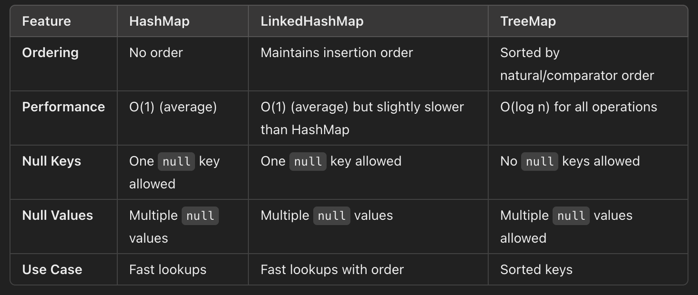

## Building Blocks

### Comments

```java
// single line comment

/*
* Multiple line comment
*/

/**
 * 
 * Java doc comment, used for generating documentation
 * @see https://www.baeldung.com/javadoc
 * 
 * /
```
**How to generate javadoc**
```
javadoc -d JavaDoc Calculator.java
```
[Example for Javadoc](./Calculator.java)  

### Defining Class and Files

- At most one public class can be in a java file.
- If there is any public class then it should be same as file name

### Writing main() method

- Program stars from ```public static void main(String[] args)``` method call.
- After compilation generates ```.class``` file.
- The variable name ```args``` hints that this list contains values that were read in (arguments) when the JVM started.

### Packages and Imports
- To run the java file use below commands
    ```bash
        javac filename.java
        java filename {arguments}

        // other ways of compiling
        javac packagea/ClassA.java packageb/ClassB.java 
    ```
- Java puts classes in packages.
- Packages are used to avoid naming conflicts
- You have to import packages in order to use the files in the package.
    ```java
    import java.util.*; // all the files in the package
    import java.util.Random; // only a single java class
    ```
- If you explicitly import a class name, it takes precedence over any wildcards present. 
- In case of conflict you could in this way
    ```java
    import java.util.Date;
    public class Conflicts {
        Date date;
        java.sql.Date sqlDate;
    }
    ```
- ```java.lang``` package is imported by default. It contains System, Wrappper, Object, Runtime, Thread, Compiler classes.
- If no package is defined then it's called **default package**.
- To defined a package use below format.  
    ```package dbms;```

### Creating Objects
- Use ```new``` keyword to create the object.
    ```java
    Animal dog = new Animal();
    ```
- ```Animal()``` is the constructor which is used to initialize the object.
- The name of the constructor matches the name of the class, and there's no return type.
    ```java
    public void Chick() { } // NOT A CONSTRUCTON
    ```
- If you do not create any constructor then compiler will provide you a **default constructor** which do not accept any arguments. This constructor is used to initiase primitive variables with default values.

- The constructor runs after all fields and instance initializer blocks have run. Order matters.
    ```java
    { System.out.println(name); }  // DOES NOT COMPILE
    private String name = "Fluffy";
    ```

### Primitive Types

Java has eight built-in data types, referred to as the Java primitive types.

| Type | Description | Default | Size | Example | Range of values |
| ---- | ----------- | ------- | ---- | ------- | --------------- |
| boolean  |	true or false |	false |	8 bits 	| true, false 	| true, false |
| byte |	twos-complement integer |	0 | 	8 bits | 	(none) 	| -128 to 127 |
| char | 	Unicode character |	\u0000 |	16 bits |	‘a’, ‘\u0041’, ‘\101’, ‘\\’, ‘\’, ‘\n’, ‘β’ 	| characters representation of ASCII values 0 to 255 |
| short | 	twos-complement integer | 	0 | 	16 bits | 	(none) | 	-32,768 to 32,767 |
| int |	twos-complement intger |	0 	| 32 bits |	-2,-1,0,1,2 |	-2,147,483,648 to 2,147,483,647 |
| long |	twos-complement integer | 	0 |	64 bits |	-2L,-1L,0L,1L,2L |	-9,223,372,036,854,775,808 to 9,223,372,036,854,775,807 |
| float |	IEEE 754 floating point |	0.0 |	32 bits |	1.23e100f , -1.23e-100f , .3f ,3.14F |	upto 7 decimal digits |
| double |	IEEE 754 floating point |	0.0 |	64 bits |	1.23456e300d , -123456e-300d , 1e1d |	upto 16 decimal digits |

- Use L/l at the end of literal to mark it as long and use f/F as the end of literal to mark it as float type.

### Variables and Identifiers
- The name must begin with a letter or the symbol $ or _.
- Local variables must be initialized before use. 
    ```java
    int q;
    System.out.println(q); // compile time error
    ```

    ```java
    public void findAnswer(boolean check) {
        int answer;
        int onlyOneBranch;
        if (check) {
            onlyOneBranch = 1;
            answer = 1;
        } else {
            answer = 2;
        }
        System.out.println(answer);
        System.out.println(onlyOneBranch); // DOES NOT COMPILE
    }
    ```
- Instance and class variables do not require you to initialize them.
- Scope
    - Local variables—in scope from declaration to end of block
    - Instance variables—in scope from declaration until object garbage collected
    - Class variables—in scope from declaration until program ends


### Difference between final, finally and finalize

| Sr. no. | 	Key |	final |	finally	| finalize |
| ------- | ------- | ------- | ------- | -------- |
| 1. |	Definition |	final is the keyword and access modifier which is used to apply restrictions on a class, method or variable. |	finally is the block in Java Exception Handling to execute the important code whether the exception occurs or not.	|finalize is the method in Java which is used to perform clean up processing just before object is garbage collected. |
| 2. |	Applicable to |	Final keyword is used with the classes, methods and variables. |	Finally block is always related to the try and catch block in exception handling. |	finalize() method is used with the objects. |
| 3. |	Functionality |	<span style="color:#E19898">(1) Once declared, final variable becomes constant and cannot be modified. (2) final method cannot be overridden by sub class. (3) final class cannot be inherited.</span> | <span style="color:#E19898">(1) finally block runs the important code even if exception occurs or not. (2) finally block cleans up all the resources used in try block. </span> | <span style="color:#E19898">finalize method performs the cleaning activities with respect to the object before its destruction.</span>
| 4. |	Execution |	Final method is executed only when we call it. | Finally block is executed as soon as the try-catch block is executed. It's execution is not dependant on the exception. | finalize method is executed just before the object is destroyed.

### Difference between ```equals()``` and ==

```java
String a = "Hey";
String b = new String("Hey");

if(a == b)
    System.err.println("Equal");
else
    System.out.println("Not"); // this executes
```

### Constructor Definition Rules:

- The first statement of every constructor is a call to another constructor within the class using this(), or a call to a constructor in the direct parent class using super().
- The super() call may not be used after the first statement of the constructor.
- If no super() call is declared in a constructor, Java will insert a no-argument super() as the first statement of the constructor.
- If the parent doesn't have a no-argument constructor and the child doesn't define any constructors, the compiler will throw an error and try to insert a default no-argument constructor into the child class.
- If the parent doesn't have a no-argument constructor, the compiler requires an explicit call to a parent constructor in each child constructor.

### Overriding a method is not without limitations, though. The compiler performs the following checks when you override a nonprivate method:

- The method in the child class must have the same signature as the method in the parent class.
- The method in the child class must be at least as accessible or more accessible than the method in the parent class.
- The method in the child class may not throw a checked exception that is new or broader than the class of any exception thrown in the parent class method.
- If the method returns a value, it must be the same or a subclass of the method in the parent class, known as covariant return types


### Important Points

- Variables and static methods are shadowed but not overridden.
- A class or interface type T will be initialized immediately before the first occurrence of any one of the following:

    > T is a class and an instance of T is created.  
    > T is a class and a static method declared by T is invoked.  
    > A static field declared by T is assigned.  
    > A static field declared by T is used and the field is not a constant variable.  
    > T is a top-level class, and an assert statement lexically nested within T is executed. 
- hashCode() method returns the hash code for the Method class object.

- Features Introduced in Java 8 :
    - Stream API
    - Lambda Expressions : A lambda expression in Java is a concise way to represent an anonymous function—a function without a name. Introduced in Java 8, it enables functional programming features and is widely used with the Stream API and functional interfaces like Runnable, Callable, and Comparator
    - Functional Interface : Interface with a single abstract method which can be implemented using lambda expression.
    - Date/Time API
    - Comparable and Comparator
    - Interface Default and Static Methods : interfaces can have static and default methods that, despite being declared in an interface, have a defined behavior.
    - Method References
        - Reference to a Static Method ```anyMatch(User::isRealUser)```
        - Reference to an Instance Method ```anyMatch(user::isLegalName)```
        - Reference to an Instance Method of an Object of a Particular Type ```filter(String::isEmpty)```
        - Reference to a Constructor ```map(User::new)```
    - Optional<T> : Optional<T> class can help to handle situations where there is a possibility of getting the NPE. It works as a container for the object of type T. It can return a value of this object if this value is not a null. When the value inside this container is null, it allows doing some predefined actions instead of throwing NPE.
- In Java, the transient and volatile keywords are used to improve the reliability and efficiency of applications. They are used to: 
    - The transient keyword prevents sensitive data from being serialized, ensuring it remains private
    - The volatile keyword ensures that all threads have access to the most up-to-date value
    - The transient and volatile keywords help to write robust and thread-safe code

    - Transient: Used with instance variables to exclude them from serialization
    - Volatile: Used with variables to indicate that the JVM and compiler always read its value from main memory
    
    Differences between transient and volatile
    - transient cannot be used with the static keyword, but volatile can 
    - transient variables are initialized with default values during de-serialization 
    - volatile ensures visibility and atomicity for simple read and write operations 


### Stream API

The Stream API in Java, introduced in Java 8, is a powerful tool for working with sequences of elements. It allows you to perform operations like filtering, mapping, and reducing on collections or arrays in a declarative, functional programming style. Streams enable efficient processing of data by supporting lazy evaluation, parallel execution, and concise syntax.

```java
import java.util.*;
import java.util.stream.*;

public class StreamExample {
    public static void main(String[] args) {
        // Create a list of numbers
        List<Integer> numbers = Arrays.asList(1, 2, 3, 4, 5, 6, 7, 8, 9, 10);

        // Filter even numbers, square them, and collect into a list
        List<Integer> evenSquares = numbers.stream()
                                           .filter(n -> n % 2 == 0) // Filter even numbers
                                           .map(n -> n * n)         // Square them
                                           .collect(Collectors.toList()); // Collect results

        System.out.println("Even squares: " + evenSquares);
    }
}
```



### Resources

- [JDK vs JRE vs JVM](https://www.geeksforgeeks.org/differences-jdk-jre-jvm/)
- [Internal Working of Java HashMap](https://www.javatpoint.com/working-of-hashmap-in-java)
- [Integer vs int](https://www.theserverside.com/blog/Coffee-Talk-Java-News-Stories-and-Opinions/int-vs-Integer-java-difference-comparison-primitive-object-types#:~:text=The%20key%20difference%20between%20the,included%20in%20the%20Java%20API.)
- [Comparable vs Comparator](https://www.javatpoint.com/difference-between-comparable-and-comparator)
- [Double-Checked Locking](https://refactoring.guru/java-dcl-issue)